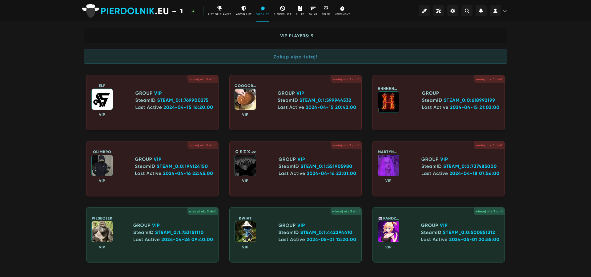

# LR WEB - Lista vipow pod SklepCS
 Lista vipow dla Level Ranks Web z motywem Rich pod SklepCS.  
 Jest to modul stworzony przez [Toil z HLmod](https://hlmod.net/resources/lr-web-spisok-vip-igrokov.4159/) zmodyfikowany przeze mnie aby funkcjonowal z SklepCS oraz dodalem tam kilka poprawek wizualnych.

## Preview

## Instalacja:
- Jako administrator w Level Ranks Web dodajesz wlasnego moda o nazwie **Vips**, wypelniasz danymi a w nazwie tabeli wpisujesz **sklepcs_vip**
- Plik module_page_vips przenosisz do modulow
- Przechodzac do module_page_vips/forward/data w biednej funkcji o nazwie **grouptell** zmieniasz flage oraz nazwe rangi. If'ow moze byc kilka.
- I w sumie to tyle.
